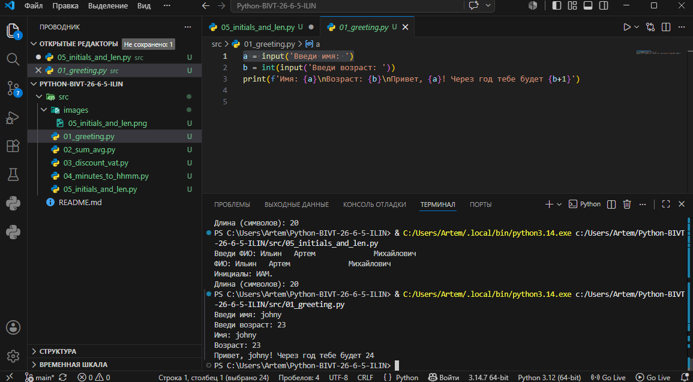
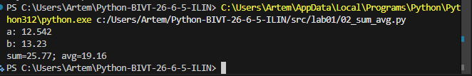
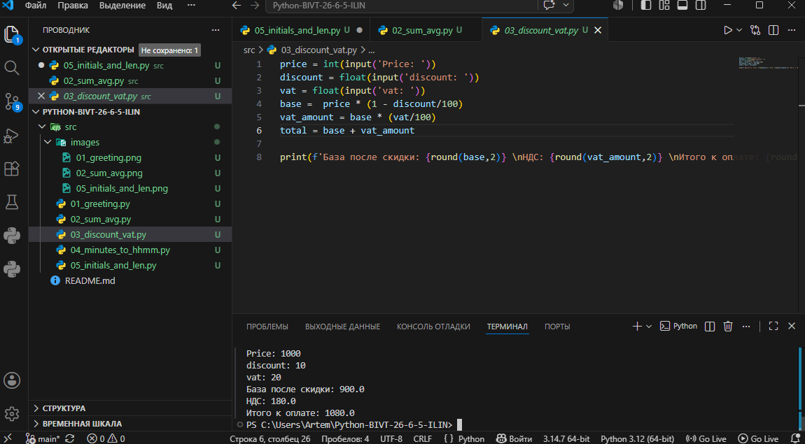
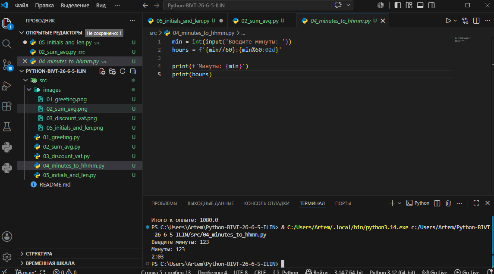
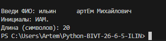
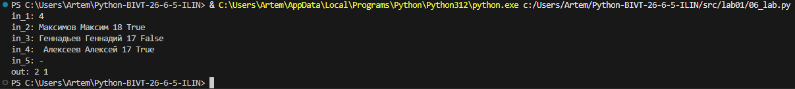
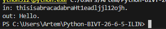

# ЛР1 ввод/вывод

### 1 Задание
```py
a = input('Имя: ')
b = int(input('Возраст: '))
print(f'Привет, {a}! Через год тебе будет {b+1}')
```



### 2 Задание
```py
a = float(input('a:').replace(',','.'))
b = float(input('b:').replace(',','.'))
print('sum=' + str(round(a + b,2)), 'avg=' + str(round((a + b)/2,2)))
```



### 3 Задание
```py
price = int(input('Price: '))
discount = float(input('discount: '))
vat = float(input('vat: '))
base =  price * (1 - discount/100)
vat_amount = base * (vat/100)
total = base + vat_amount

print(f'База после скидки: {round(base,2)} \nНДС: {round(vat_amount,2)} \nИтого к оплате: {round(total,2)}')
```



### 4 Задание
```py
min = int(input('Минуты: '))
hours = f'{min//60}:{min%60:02d}'

print(hours)
```



###  5 Задание
```py
fio = input('Введи ФИО: ')
ini = fio.split()
i = ini[0][0].upper()+ini[1][0].upper()+ini[2][0].upper()
print(f'Инициалы: {i}.')
print(f'Длина (символов): {len(ini[0])+len(ini[1])+len(ini[2])+2}')
```


###  6 задание
```py
t = 0
f = 0
a = int(input('in_1: '))
for x in range(a):
    a2 = input(f'in_{x+2}: ').split()
    if len(a2) == 4:
        if a2[3] == 'True':
            t+=1
        else:
            f+=1
    else:
        break
    
print(f'out: {t} {f}')
```



### 7 Задание
```py
a = 'thisisabracadabraHt1eadljjl12ojh.'
print(f'in: {a}')
b = ''
for x in range(len(a)):
    if a[x] in 'QWERTYUIOPASDFGHJKLZXCVBNM': 
        k = a[x]
        
        b = b.join(k)
        d = a.index(k)
        break
for x in range(len(a)):
    if a[x] in '0123456789': 
        b += b.join(a[x+1])
        c = a.index(a[x+1])
        break
r = c-d 

for x in range(23,len(a),r):
    b += b.join(a[x])

print(f'out: {b}')
```
