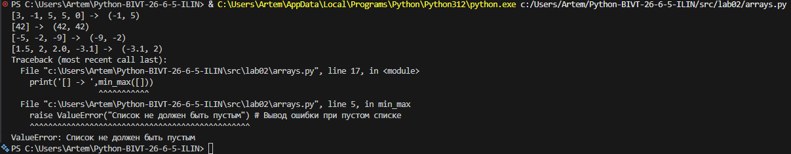
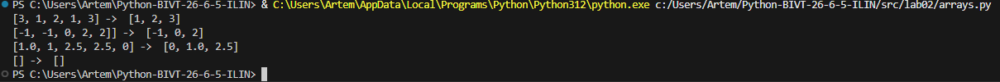
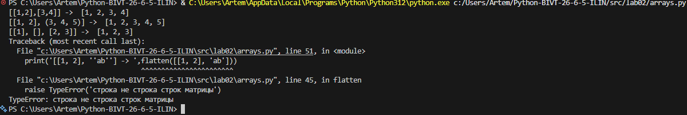
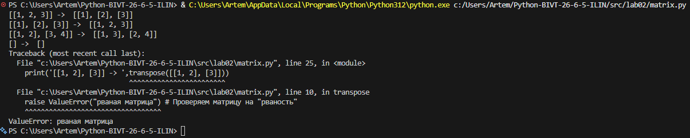
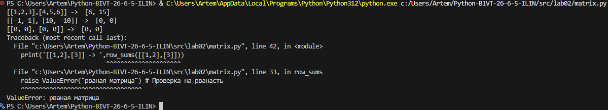
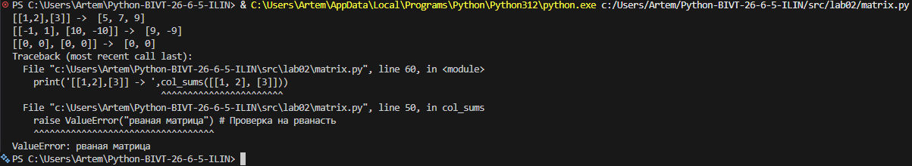
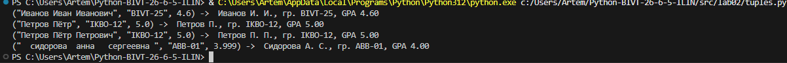

# ЛР2 — Коллекции и матрицы (list/tuple/set/dict)

## Задание 1 - min_max
```py
def min_max(nums: list[float | int]) -> tuple[float | int, float | int]:
    if len(nums) == 0: 
        raise ValueError("Список не должен быть пустым") # Вывод ошибки при пустом списке
    max_num = nums[0] # Создание сравнимых чисел
    min_num = nums[0]
    for num in nums:
        if num > max_num: max_num = num # Проверка по числам
        if num < min_num: min_num = num
    return (min(nums), max(nums))

print('[3, -1, 5, 5, 0] -> ',min_max([3, -1, 5, 5, 0]))
print('[42] -> ',min_max([42]))
print('[-5, -2, -9] -> ',min_max([-5, -2, -9]))
print('[1.5, 2, 2.0, -3.1] -> ',min_max([1.5, 2, 2.0, -3.1]))
print('[] -> ',min_max([]))
```


## Задание 2 - unique_sorted
```py
def unique_sorted(nums: list[float | int]) -> list[float | int]:
    snums = [] # Пустой список для сортировки чисел
    for i in range(len(nums)):
        if nums[i]<=nums[i]: # Проверка чисел и добавление их в список
            if nums[i] not in snums:
                snums.append(nums[i])
            else:
                continue # Если число есть в списке
    return sorted(snums)

print(unique_sorted([3, 1, 2, 1, 3]))
print(unique_sorted([-1, -1, 0, 2, 2]))
print(unique_sorted([1.0, 1, 2.5, 2.5, 0]))
print([])
```


## Задание 3 - flatten
```py
def flatten(mat: list[list | tuple]) -> list:
    new_mat = [] # Список новой матрицы
    for i in mat:
        if type(i) == list or type(i) == tuple: # Проверка на тип
            for x in i:
                new_mat.append(x) # Добавление цифры в матрицу
        else:
            raise TypeError('строка не строка строк матрицы') 
    return new_mat

print('[[1,2],[3,4]] -> ',flatten([[1,2],[3,4]]))
print('[[1, 2], (3, 4, 5)] -> ',flatten([[1, 2], (3, 4, 5)]))
print('[[1], [], [2, 3]] -> ',flatten([[1], [], [2, 3]]))
print('[[1, 2], ''ab''] -> ',flatten([[1, 2], 'ab']))
```


## Заданиие 4 - transpose
```py

def transpose(mat: list[list[float | int]]) -> list[list]:
    if not mat: # Обрабатываем пустую матрицу
        return []   
    
    cols_count = len(mat[0])  # Берем длину первой строки за основу
    for row in mat:
        if len(row) != cols_count:
            raise ValueError("рваная матрица") # Проверяем матрицу на "рваность"
    
    t_mat = [] # Создаем новую пустую матрицу  
    for col in range(cols_count): # Проходимся по столбцам исходной матрицы
        new_row = []
        for row in range(len(mat)): # Проходимся по строкам исходной матрицы
            new_row.append(mat[row][col])
        t_mat.append(new_row)

    return t_mat

print('[[1, 2, 3]] -> ',transpose([[1, 2, 3]]))
print('[[1], [2], [3]] -> ',transpose([[1], [2], [3]]))
print('[[1, 2], [3, 4]] -> ',transpose([[1, 2], [3, 4]]))
print('[] -> ',transpose([]))
print('[[1, 2], [3]] -> ',transpose([[1, 2], [3]]))
```


# Задание 5 - row_sums
```py
def row_sums(mat: list[list[float | int]]) -> list[float]:
    cols_count = len(mat[0])  
    for row in mat:
        if len(row) != cols_count:
            raise ValueError("рваная матрица") # Проверка на рванасть
    sum_mat = []
    for row in mat:
        sum_mat.append(sum(row)) # Сумма строк
    return sum_mat

print('[[1,2,3],[4,5,6]] -> ',row_sums([[1,2,3],[4,5,6]]))
print('[[-1, 1], [10, -10]] -> ',row_sums([[-1, 1], [10, -10]]))
print('[[0, 0], [0, 0]] -> ',row_sums([[0, 0], [0, 0]]))
print('[[1,2],[3]] -> ',row_sums([[1,2],[3]]))
```


# Задание 6 - col_sums
```py
def col_sums(mat: list[list[float | int]]) -> list[float]:
    cols_count = len(mat[0])  
    for row in mat:
        if len(row) != cols_count:
            raise ValueError("рваная матрица") # Проверка на рванасть
    col = zip(*mat) # Распаковка столбцов по 2 числа вв один кортеж
    new_sum = [] # Список сумм
    for i in col:
        new_sum.append(sum(list(i))) # Преобразование кортежа в список и его суммирование
    return new_sum

print('[[1,2],[3]] -> ',col_sums([[1, 2, 3], [4, 5, 6]]))
print('[[-1, 1], [10, -10]] -> ',col_sums([[-1, 1], [10, -10]]))
print('[[0, 0], [0, 0]] -> ',col_sums([[0, 0], [0, 0]]))
print('[[1,2],[3]] -> ',col_sums([[1, 2], [3]]))
```


# Задание 7 Форма
```py
def format_record(rec: tuple[str, str, float]) -> str:
    if type(rec) != tuple: #Проверка на кортеж 
        raise TypeError("Входные данные должны быть кортежем")
    gpa = round(rec[2],2)
    if not (0.0 <= gpa <= 5.0):
        raise ValueError("GPA должен быть в диапазоне от 0.0 до 5.0")
    fio = rec[0].split()
    if len(fio) == 0:
        raise ValueError('Напиши имя')
    name = fio[0].lower() # Имя с строчных букв
    gr = rec[1]
    if len(gr) == 0:
        raise ValueError('Напиши группу')
    if len(fio)== 3: 
        fio1 = f'{name[0].upper()+name[1:]} {fio[1][0].upper()}. {fio[2][0].upper()}.' # Сбор ФИО+группы+гпа
    else: 
        fio1 = f'{name[0].upper()+name[1:]} {fio[1][0].upper()}.' # Если неполное фио
    fio1 = f'{fio1.strip()}, гр. {gr.strip()}, GPA {gpa:.2f}'
    return fio1

print('("Иванов Иван Иванович", "BIVT-25", 4.6) -> ',format_record(("   Иванов Иван Иванович", "    BIVT-25",           4.6)))
print('("Петров Пётр", "IKBO-12", 5.0) -> ',format_record(("   Петров Пётр", "IKBO-12", 5.0)))
print('("Петров Пётр Петрович", "IKBO-12", 5.0) -> ',format_record(("Петров Пётр Петрович", "IKBO-12   ", 5.0)))
print('("  сидорова  анна   сергеевна ", "ABB-01", 3.999) -> ',format_record(("  сидорова  анна   сергеевна ", "ABB-01", 3.999)))
# print(format_record(("  ", "ABB-01", 3.999)))
# print(format_record(("фыв  фыв фыв", "", 3.999)))

```
